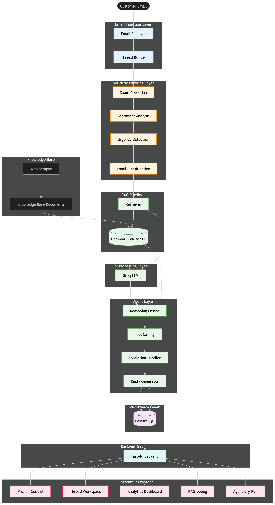

# SenAI CRM — AI-Powered Email Intelligence Platform

## Overview

A production-grade AI CRM system that autonomously monitors emails, triages with multi-dimensional intelligence, executes agentic workflows, and surfaces real-time business insights.

## Tech Stack

| Component  | Technology                       | Reason                              |
| ---------- | -------------------------------- | ----------------------------------- |
| Backend    | FastAPI (Python)                 | Fast, async, auto OpenAPI docs      |
| AI/LLM     | Groq (llama-3.3-70b)             | Free tier, extremely fast inference |
| RAG        | ChromaDB + sentence-transformers | Local vector DB, no API cost        |
| Database   | SQLite + SQLAlchemy              | Zero-config, portable               |
| Frontend   | Streamlit                        | Rapid AI dashboard development      |
| Embeddings | all-MiniLM-L6-v2                 | Lightweight, accurate, free         |

## Architecture

```
┌─────────────────────────────────────────────────────────┐
│                    EMAIL INGESTION                       │
│            email-data-advanced.json (60 emails)          │
└─────────────────────┬───────────────────────────────────┘
                      ↓
┌─────────────────────────────────────────────────────────┐
│              HEURISTIC PRE-FILTER (fast)                 │
│         Spam │ Security │ Legal │ Urgency Detection      │
└──────┬────────────────┬────────────────┬────────────────┘
       ↓                ↓                ↓
   [IGNORED]       [ESCALATED]      [RECEIVED]
   Spam/Block      Security/Legal   Normal Flow
                                        ↓
┌─────────────────────────────────────────────────────────┐
│           LLM CLASSIFICATION ENGINE (Groq)               │
│     Thread History + RAG Context + Structured Output     │
└──────────────────────┬──────────────────────────────────┘
                       ↓                    ↑
              ┌────────────────┐    ┌───────────────┐
              │  AUTONOMOUS    │    │  RAG PIPELINE │
              │  AGENT (ReAct) │    │  (ChromaDB)   │
              └────────┬───────┘    └───────────────┘
                       ↓
        ┌──────────────┼──────────────┐
        ↓              ↓              ↓
  [Auto-Reply]   [Escalate]    [Flag Legal]
        ↓              ↓              ↓
┌─────────────────────────────────────────────────────────┐
│                  SQLite DATABASE                         │
│     emails │ threads │ contacts │ actions │ audit_log    │
└─────────────────────────────────────────────────────────┘
                       ↓
┌─────────────────────────────────────────────────────────┐
│              STREAMLIT DASHBOARD                         │
│   Mission Control │ Thread View │ Analytics │ RAG Debug  │
└─────────────────────────────────────────────────────────┘
```

## Setup Instructions

### 1. Clone & Install

```bash
git clone <your-repo-url>
cd senai-crm
python -m venv venv
venv\Scripts\activate  # Windows
pip install -r requirements.txt
```

### 2. Environment Variables

Create `.env` file:

GROQ_API_KEY=your_groq_api_key_here
DATABASE_URL=sqlite:///./senai_crm.db

### 3. Build Knowledge Base & Ingest Emails

```bash
cd backend
python rag_pipeline.py        # Build ChromaDB vector store
python ingestion.py           # Ingest all 60 emails
python classifier.py          # AI classify all emails
python agent.py               # Run agent on test case
```

### 4. Start the System

```bash
# Terminal 1 - Backend
cd backend
python -m uvicorn main:app --reload --port 8000

# Terminal 2 - Frontend
cd frontend
streamlit run app.py
```

### 5. Access

- Frontend: http://localhost:8501
- API Docs: http://localhost:8000/docs
- Dashboard Stats: http://localhost:8000/dashboard/stats

## Components Built

### Component 1 — Email Ingestion

- POST /api/ingest with schema validation
- Deduplication via message_id
- Heuristic pre-filter (spam, security, legal, urgency)
- Auto thread linking

### Component 2 — Multi-Layer Intelligence

- Layer 1: Heuristic filter (sub-10ms, keyword-based)
- Layer 2: LLM Classification (Groq llama-3.3-70b)
- Layer 3: Sentiment trend tracking per sender
- Structured JSON output with confidence scores

### Component 3 — RAG Pipeline

- 6 knowledge base documents (pricing, SLA, refund, API, compliance, escalation)
- ChromaDB vector store with sentence-transformers embeddings
- 300-500 token chunks with overlap
- Top-3 retrieval injected into every LLM prompt

### Component 4 — Autonomous Agent (ReAct Pattern)

- 7 tools: search_kb, get_thread, get_contact, check_account, escalate, flag_legal, create_ticket, draft_reply
- Chain-of-Thought reasoning trace stored in DB
- Max 6 tool calls per email
- Dry-run mode available
- Never auto-replies to: ransomware, legal threats, GDPR, Critical urgency

### Component 6 — Database

- SQLite with SQLAlchemy ORM
- Tables: contacts, threads, emails, actions, audit_log
- Full audit trail for every agent action

### Component 7 — Backend API

- 15 REST endpoints
- Consistent error envelopes
- Auto OpenAPI docs at /docs

### Component 8 — Frontend Dashboard

- Mission Control: stats, filterable email list
- Thread Workspace: timeline, contact profile, agent reasoning trace
- Analytics: sentiment trends, category breakdown, at-risk accounts
- RAG Debug: knowledge base search with similarity scores
- Agent Dry Run: step-by-step reasoning without execution

## Special Scenarios Handled

| Scenario                 | Handling                                                                   |
| ------------------------ | -------------------------------------------------------------------------- |
| Ransomware (msg_038)     | Immediately flagged Critical, escalated to security, NEVER auto-replied    |
| GDPR Request (msg_052)   | Detected as Compliance/Legal, flagged for legal, compliance ticket created |
| Karen churn threat       | Negative sentiment detected, retention playbook retrieved via RAG          |
| Bob SLA breach (msg_060) | Full thread retrieved, SLA policy searched, flagged for legal + escalated  |
| Spam emails              | Heuristic filter catches at ingest, status=Ignored, never auto-replied     |

## Documentation

### Architecture Diagram



### API Documentation

OpenAPI specification is available at:

- `docs/openapi.json`

Swagger UI can be accessed locally at:

```text
http://localhost:8000/docs
```

## Architectural Decisions & Trade-offs


### SQLite vs PostgreSQL

- Chose SQLite for zero-config portability in demo
- Production: switch to PostgreSQL + pgvector for vector search

### Groq vs OpenAI

- Groq: free tier, 10x faster inference, llama-3.3-70b comparable quality
- Trade-off: less reliable structured JSON output vs GPT-4

### ChromaDB vs Pinecone

- ChromaDB: fully local, no API key, no cost
- Trade-off: no cloud sync, single-node only

### Streamlit vs React

- Streamlit: Python-native, rapid development, perfect for AI dashboards
- Trade-off: less customizable UI vs React

## Known Limitations

- msg_034 had JSON parse error during classification (1/60 emails)
- Churn risk score not yet dynamically calculated
- Web scraping module (Component 5) implemented as mock data
- No WebSocket real-time updates (polling-based)

## API Documentation

Full OpenAPI spec available at: http://localhost:8000/docs
